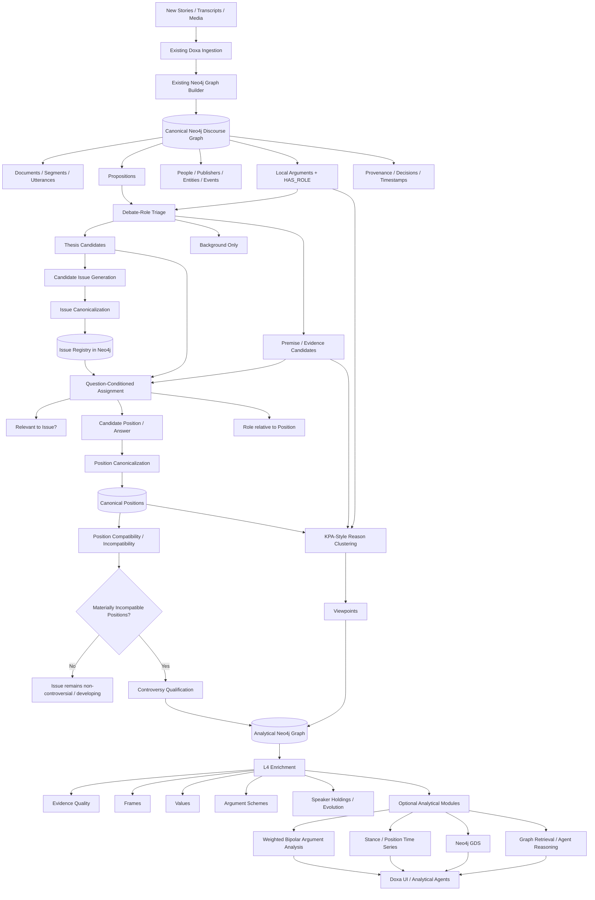

# Doxa Architecture Proposal 2

## Issue-First Argument & Controversy Architecture

## Objective

Doxa already has a strong lower-level discourse graph in Neo4j. The current ingestion and graph-building system captures the evidence substrate required for higher-order analysis:

- Stories / documents
- Segments / chunks / utterances
- Propositions / claims
- People / speakers
- Publishers / organizations
- Entities / events
- Local arguments
- Argument roles such as premise / conclusion / objection / rebuttal / qualifier
- Speech acts and related proposition metadata
- Provenance, timestamps, and source relationships
- Decision / MethodRun-style analytical provenance

**Do not rebuild this substrate.**

The architectural weakness is above it: Doxa currently risks turning semantic relatedness into disagreement, and then turning a small number of bad disagreement edges into apparently coherent Viewpoints and Controversies.

The revised goal is to build an analytical layer that answers, in order:

```text
What question is actually being discussed?
        ↓
What answers / positions are being advanced?
        ↓
Which of those positions are materially incompatible?
        ↓
Why does each speaker or argument hold that position?
        ↓
Which recurring reasons deserve to become Viewpoints?
        ↓
When does an Issue actually qualify as a Controversy?
```

The core invariant is:

> **Relatedness proposes. Issue membership organizes. Incompatibility establishes conflict. Reasons distinguish Viewpoints.**

This proposal intentionally does **not** make StanceMining, oAMF, PAKT, PyArg, GraphRAG, or any other research library the backbone of Doxa. Those systems may be useful instruments, benchmarks, or optional analytical modules, but Doxa should own the ontology and construction order.

---

# 1. Diagnosis of the Current Failure Mode

The current L3 architecture can effectively behave like:

```text
embedding / entity relatedness
        ↓
pair candidates
        ↓
agree / oppose / related classification
        ↓
clusters
        ↓
Viewpoints
        ↓
Controversies
        ↓
question / label generated afterward
```

This order is backwards.

A pair of propositions can be:

- about the same entity but different questions;
- about the same issue but compatible;
- factually related without either being a position;
- two different reasons for the same position;
- talking past one another;
- mutually qualifying rather than opposing;
- different causal explanations that can coexist;
- genuinely incompatible.

Pairwise semantic similarity cannot reliably distinguish these structural roles by itself.

The main error is therefore not merely a weak classifier. It is the ontology and construction order.

A controversy should not be discovered by clustering apparent opposition and naming the cluster afterward.

Instead:

> **Doxa should identify the Issue first, organize claims around candidate answers to that Issue, and only then determine whether meaningful incompatibility exists.**

---

# 2. Conceptual Ontology

The proposed L3+ ontology has four distinct concepts:

```text
Issue
  ↓
Position
  ↓
Viewpoint

Issue + materially incompatible Positions
  ↓
Controversy
```

These concepts must not be collapsed into one another.

## 2.1 Issue

An `Issue` is the canonical question under discussion.

Examples:

```text
Should the United States continue military aid to Ukraine?

What caused the post-pandemic increase in inflation?

Was the 2021 Afghanistan withdrawal handled competently?

Who bears primary responsibility for the federal budget deficit?

What should the legal standard for abortion access be?
```

An Issue may exist even when the corpus currently contains only one side.

This is a critical distinction.

A question can be discussed without yet qualifying as a controversy in Doxa's data.

Therefore:

```text
Issue ≠ Controversy
```

Conceptually:

```text
(:Controversy)-[:ABOUT]->(:Issue)
```

If the current schema makes a separate node unnecessarily expensive or duplicative, Cursor should explicitly evaluate alternatives during integration design. However, the **semantic distinction must survive** even if the implementation temporarily reuses an existing node shape.

---

## 2.2 Position

A `Position` is a canonical answer to an Issue.

For a binary policy question:

```text
Issue:
Should the U.S. continue military aid to Ukraine?

Position A:
The U.S. should continue military aid to Ukraine.

Position B:
The U.S. should end or substantially reduce military aid to Ukraine.
```

For other Issue types, positions may not be binary.

Example:

```text
Issue:
What caused the recent increase in inflation?

Position A:
Fiscal stimulus was a major cause.

Position B:
Supply-chain disruption was a major cause.

Position C:
Energy shocks were a major cause.

Position D:
Corporate pricing power materially contributed.
```

These answers are **different**, but they are not necessarily mutually exclusive.

This is why Doxa should not reduce every Issue to `FAVOR` / `AGAINST`.

---

## 2.3 Viewpoint

A `Viewpoint` is a recurring reasoning pattern for holding a Position.

Conceptually:

```text
Viewpoint = Position + characteristic reason / rationale
```

Example:

```text
Issue:
Should the U.S. continue military aid to Ukraine?

Position:
AGAINST continued aid

Viewpoint 1:
End aid because European governments should assume more responsibility.

Viewpoint 2:
End aid because foreign military intervention is strategically harmful.

Viewpoint 3:
End aid because domestic spending should take priority.
```

All three share a Position.

They are not necessarily the same Viewpoint.

This is the product problem that **Key Point Analysis-style clustering** is especially well suited to solve.

---

## 2.4 Controversy

A `Controversy` is not merely an Issue that has multiple answers.

It is an Issue for which Doxa has sufficient evidence of **materially incompatible Positions**.

Conceptually:

```text
Controversy = Issue
              + multiple materially incompatible Positions
              + sufficient analytical confidence
```

Additional product-level maturity signals may include:

- number of supporting propositions;
- number of independent speakers;
- publisher/source diversity;
- persistence across time;
- argument quality;
- confidence of Issue assignment;
- confidence of Position canonicalization;
- confidence of incompatibility judgments.

These should generally affect **confidence, maturity, prominence, or ranking** rather than the logical identity of the controversy.

For example, source diversity is useful evidence that a controversy is broadly represented, but a real disagreement should not cease to exist merely because both sides were quoted in one high-quality source.

---

# 3. Issue Types Matter

One of the largest risks in both the current architecture and a simple binary stance architecture is assuming all public disagreement has the same logical form.

Doxa should give each Issue a `question_type`.

A practical initial taxonomy might include:

| Question Type | Example | Typical Position Structure |
|---|---|---|
| `policy` | Should the U.S. continue aid to Ukraine? | favor / oppose / qualify / conditional |
| `normative` | Is affirmative action fair? | evaluative positions |
| `causal` | What caused inflation? | one or more causal explanations |
| `attribution` | Who is responsible for the border situation? | actor / institution / mixed responsibility |
| `factual_dispute` | Did the policy reduce crime? | true / false / uncertain / scope-qualified |
| `predictive` | Will tariffs increase consumer prices? | predicted outcomes / probabilities |
| `definitional` | What should count as a recession? | competing definitions / criteria |
| `interpretive` | What does the election result indicate? | competing interpretations |
| `priority` | Which issue should Congress address first? | ranked priorities |

This taxonomy should begin small and expand only when the corpus demonstrates a need.

The point is not to create a perfect philosophical ontology.

The point is to prevent Doxa from forcing fundamentally different disagreement structures into one binary stance model.

---

# 4. Target Architecture



---

# 5. Layer 1 — Preserve the Existing Discourse Substrate

Neo4j remains the canonical source of truth for the underlying discourse.

It should answer:

```text
Who said what?
Where did they say it?
When did they say it?
What was the surrounding context?
Which proposition came from which utterance?
Which local premises / conclusions / objections were present?
Which people, organizations, entities, and events were referenced?
```

Do not duplicate lower-level extraction in another argument-mining system unless a benchmark proves the current extraction is insufficient.

In particular, downstream L3 systems should generally consume existing:

- Proposition IDs
- Argument IDs
- `HAS_ROLE`
- speech-act metadata
- source text spans
- speaker attribution
- timestamps
- provenance

Every higher-order inference must remain traceable back to this substrate.

---

# 6. Layer 2 — Debate-Role Triage, Not an Argumentativeness Gate

The original proposal used a binary `argumentative / non-argumentative` gate.

That is too destructive.

A factual proposition may be unsuitable as the thesis of a Viewpoint while still being crucial evidence inside an argument.

Instead, classify propositions by **debate role eligibility**.

## 6.1 Thesis Candidate

A proposition may found or express a Position / Issue.

Signals can include existing data such as:

- `HAS_ROLE = conclusion`
- `HAS_ROLE = objection`
- `HAS_ROLE = rebuttal`
- `HAS_ROLE = prediction`
- `HAS_ROLE = value`
- prescriptive speech acts
- judgments
- allegations
- predictions
- explicit causal explanations
- explicit attribution of responsibility

Example:

```text
"The U.S. should stop sending weapons to Ukraine."
```

This can directly answer an Issue.

---

## 6.2 Premise / Evidence Candidate

A proposition may support, attack, qualify, contextualize, or undercut a thesis without itself defining a side.

Example:

```text
"European defense spending increased again this year."
```

By itself, this should not become a competing Viewpoint on Ukraine aid.

But it may be used as evidence against:

```text
"Europe is unwilling to contribute to its own defense."
```

Therefore factual assertions must remain available for downstream argument structure.

---

## 6.3 Background Only

Some material may currently have neither a thesis role nor a useful premise attachment.

It remains in the objective graph but does not enter debate topology until later evidence gives it a relevant role.

This is a **routing decision**, not deletion.

---

# 7. Layer 3 — Candidate Issue Generation

Doxa should generate candidate Issues from **thesis-like propositions**, not from arbitrary clusters of related text.

For each thesis candidate, generate one or more explicit interrogatives that the proposition plausibly answers.

Example:

```text
Proposition:
"The U.S. should stop sending weapons to Ukraine."

Candidate Issue:
"Should the United States continue military aid to Ukraine?"
```

Another proposition:

```text
"Biden's stimulus policies contributed substantially to inflation."

Candidate Issue:
"What caused the post-pandemic increase in U.S. inflation?"
```

Candidate generation should prefer questions that are:

- explicit;
- falsifiable or answerable enough to organize positions;
- appropriately scoped;
- temporally bounded where necessary;
- not merely entity/topic labels;
- capable of admitting the proposition as a natural answer.

Bad Issue:

```text
Ukraine
```

Bad Issue:

```text
U.S. foreign policy
```

Good Issue:

```text
Should the United States continue military aid to Ukraine?
```

Good Issue:

```text
Who should bear primary responsibility for financing Ukraine's defense?
```

These two questions may be related but must not be merged merely because they share the same entities.

---

# 8. Layer 4 — Canonical Issue Reconciliation

Continuous ingestion will produce paraphrased candidate questions.

Examples:

```text
Should the U.S. keep sending weapons to Ukraine?

Should Washington maintain military assistance to Kyiv?

Should American military aid for Ukraine continue?
```

These may represent the same Issue.

The reconciliation layer should compare candidate questions against the existing Issue registry using multiple signals:

- embeddings;
- normalized entities;
- predicate / action;
- subject / object structure;
- temporal scope;
- geographic scope;
- modality;
- polarity-independent semantics;
- qualifiers / exceptions;
- question type;
- LLM adjudication for ambiguous cases.

The key rule remains:

> **Shared topic or entity is never sufficient for Issue identity.**

Examples that should remain distinct:

```text
Should the U.S. continue aid to Ukraine?

Should NATO admit Ukraine?

Should Europe spend more on defense?

Who should finance Ukraine's reconstruction?
```

All are topically adjacent.

They are not the same Issue.

## 8.1 Relationship Between Similar Issues

Rather than over-merging, Doxa may preserve relationships such as:

```text
VARIANT_OF
BROADER_THAN
NARROWER_THAN
TEMPORAL_VARIANT_OF
RELATED_ISSUE
```

when analytically useful.

The current canonicalization / Decision infrastructure should be reused wherever possible.

---

# 9. Layer 5 — Question-Conditioned Proposition Assignment

Once an Issue exists, Doxa should analyze propositions **relative to that Issue**.

This is fundamentally different from open-ended target mining.

For each candidate proposition and Issue:

```text
1. Is this proposition relevant to the Issue?
2. If so, what answer / Position does it express or support?
3. What role does it play relative to that Position?
```

Possible roles include:

```text
THESIS
SUPPORT
ATTACK
UNDERCUT
QUALIFY
CONTEXT
EVIDENCE
NONE
```

A single proposition may participate in more than one Issue if the source text genuinely bears on multiple questions.

However, each assignment must be explicit and independently scored.

---

# 10. Layer 6 — Position Canonicalization

The output of Issue assignment should not immediately become a `FAVOR` or `AGAINST` edge.

Instead, normalize the substantive answer being advanced.

Example policy Issue:

```text
Issue:
Should the U.S. continue military aid to Ukraine?

Position A:
Continue military aid at approximately current levels.

Position B:
Increase military aid.

Position C:
Reduce military aid but do not end it.

Position D:
End direct military aid.
```

These can later be mapped to a coarse polarity for UI or analytics:

```text
A → FAVOR
B → FAVOR / STRONG_FAVOR
C → QUALIFY / PARTIAL_AGAINST
D → AGAINST
```

But the canonical Position preserves more information than the polarity label.

For non-binary Issues, Position canonicalization becomes even more important.

Example causal Issue:

```text
Issue:
What caused post-pandemic inflation?

Position:
Large fiscal stimulus materially increased aggregate demand.

Position:
Supply-chain constraints materially limited supply.

Position:
Energy shocks materially increased production costs.
```

A proposition may support multiple causal positions simultaneously.

Therefore:

> **Polarity is a derived analytical projection, not the universal Position ontology.**

---

# 11. Layer 7 — Compatibility and Incompatibility

This is the decisive controversy layer.

Different Positions are not automatically opposing Positions.

Doxa must explicitly determine whether two canonical Positions can reasonably coexist **as answers to the same Issue**.

Possible relation types:

```text
INCOMPATIBLE
PARTIALLY_INCOMPATIBLE
COMPATIBLE
COMPLEMENTARY
BROADER
NARROWER
CONDITIONAL_ON
ORTHOGONAL
TALKING_PAST
UNCLEAR
```

Examples:

### Genuine incompatibility

```text
Issue:
Should the U.S. continue military aid to Ukraine?

Position A:
Continue aid.

Position B:
End aid.

→ materially incompatible
```

### Compatible causal claims

```text
Issue:
What caused inflation?

Position A:
Supply constraints contributed.

Position B:
Fiscal stimulus contributed.

→ potentially compatible
```

### Partially incompatible causal claims

```text
Position A:
Inflation was primarily caused by fiscal stimulus.

Position B:
Fiscal stimulus had essentially no meaningful effect; supply shocks explain the increase.

→ materially incompatible in causal attribution
```

This is why contradiction detection, NLI, stance labels, and pairwise LLM judgments should be treated as **evidence channels**, not ontology writers.

---

# 12. How to Use Pairwise Classification and NLI

The current `RELATES_TO` taxonomy should not necessarily be deleted.

It can remain useful as analytical evidence.

Candidate evidence may include:

- current LLM relation classification;
- NLI entailment / contradiction / neutral;
- semantic similarity;
- local argument structure;
- explicit negation;
- shared Issue membership;
- Position semantics;
- source language such as "however", "but", "contrary", rebuttal markers;
- known premise / rebuttal relationships.

But none of these alone should create a Controversy.

The critical sequence is:

```text
same Issue
        ↓
canonical Positions
        ↓
compatibility / incompatibility judgment
        ↓
controversy qualification
```

A strong NLI contradiction signal can raise confidence in incompatibility.

An NLI `neutral` result should not automatically mean compatibility because policy and argumentative opposition often falls outside literal sentence contradiction.

Similarly, an LLM `oppose` label should not be authoritative if the propositions answer different questions.

---

# 13. Layer 8 — Controversy Qualification

An Issue becomes a Controversy when the graph contains sufficient evidence for materially incompatible Positions.

A minimal conceptual rule:

```text
Issue
+
2+ established Positions
+
1+ material incompatibility relation among Positions
+
sufficient confidence / evidence
=
Controversy
```

This allows Doxa to represent several useful states:

```text
Issue: discovered, little evidence
Issue: mature, one-sided discussion
Issue: multiple compatible explanations
Issue: disputed but low-confidence
Controversy: established incompatible positions
Controversy: mature, many viewpoints and sources
```

The UI can distinguish these states instead of forcing every Issue into a debate shape.

---

# 14. Layer 9 — Viewpoints via Key Point Analysis-Style Reason Clustering

This is the main place where an existing research paradigm directly matches Doxa's product semantics.

Key Point Analysis (KPA) summarizes a large collection of arguments using a small set of recurring salient points and maps individual arguments to those key points.

Doxa should adapt that pattern **inside a known Issue and Position**.

Conceptually:

```text
Issue
  ↓
Position
  ↓
all supporting theses / arguments / premises
  ↓
recurring reason discovery
  ↓
Viewpoints
```

Within each `(Issue, Position)`:

1. Gather thesis propositions assigned to the Position.
2. Gather their local supporting premises / argument structure.
3. Generate candidate concise reasons / key points.
4. Score candidates for quality, distinctiveness, and coverage.
5. Match supporting material to candidate key points.
6. Merge near-duplicate key points conservatively.
7. Quarantine ambiguous material rather than force assignment.
8. Promote sufficiently supported key points into Viewpoints.

Example:

```text
Issue:
Should the U.S. continue military aid to Ukraine?

Position:
AGAINST

Viewpoint A:
Europe should assume more of the defense burden.

Viewpoint B:
Continued U.S. involvement increases escalation risk.

Viewpoint C:
Domestic priorities should take precedence over foreign aid.
```

Each Viewpoint can then point to:

- supporting propositions;
- premises;
- speakers;
- publishers;
- examples;
- counterarguments;
- time periods;
- frames / values later.

This gives Doxa a human-readable explanation for why a Position exists instead of treating an agree-cluster as a Viewpoint.

---

# 15. KPA Is a Pattern, Not Necessarily an IBM Dependency

Doxa does not need the retired IBM Project Debater APIs to implement this architecture.

The research precedent matters because the task matches the product:

> summarize many arguments on a known topic into a small set of recurring salient points and quantify how much material maps to each point.

A v1 can use:

- current embeddings for candidate recall;
- a modern LLM for candidate key-point generation;
- embedding / cross-encoder / LLM matching;
- Decision-backed thresholds;
- conservative deduplication;
- human evaluation on a gold set.

If quality later warrants specialization, Doxa can evaluate:

- ArgKP / KPA datasets;
- fine-tuned matchers;
- contrastive encoders;
- specialized argument-quality models.

The architecture should remain independent of any one model.

---

# 16. Preserve Local Argument Structure

Doxa already extracts local Argument / `HAS_ROLE` structure.

Do not automatically run another argument miner over the same text and let it create competing canonical nodes.

The local graph should remain the default representation for:

- premise;
- conclusion;
- objection;
- rebuttal;
- qualifier;
- value;
- prediction;
- assumption.

Research tools such as oAMF may still be useful for:

- benchmarking Doxa's current extraction;
- scheme classification experiments;
- xAIF import/export;
- research interoperability;
- testing difficult samples.

But they should not become a required write-path stage unless they demonstrate measurable value over the existing graph-worker.

---

# 17. Cross-Document Argument Relationships

Once Issue and Position identity are established, Doxa can safely infer cross-document argument relationships.

Examples:

```text
Premise A ──SUPPORTS──> Position X

Claim B ──ATTACKS────> Premise A

Claim C ──UNDERCUTS──> inference from Premise A to Position X

Claim D ──QUALIFIES──> Position X
```

Cross-document reasoning should be **Issue-conditioned**.

This is much safer than asking whether arbitrary semantically related propositions support or attack one another globally.

A factual assertion that previously looked like irrelevant background can now become highly useful if it is retrieved as evidence for or against a known premise.

---

# 18. Frames, Values, and Perspective Are L4 Facets

The original proposal correctly recognized that two people can hold the same Position for very different normative or rhetorical reasons.

PAKT and ValueEval-style research are useful precedents here.

However, Frames and Values should not decide Issue identity or Controversy membership.

They are higher-order facets.

Possible enrichments:

```text
(:Viewpoint)-[:APPEALS_TO]->(:Value)
(:Viewpoint)-[:USES_FRAME]->(:Frame)
(:Argument)-[:APPEALS_TO]->(:Value)
(:Argument)-[:USES_FRAME]->(:Frame)
```

Examples:

```text
Viewpoint:
End Ukraine aid because Europe should bear more responsibility.

Frame:
Burden sharing

Values:
National responsibility
Fiscal stewardship
```

Another:

```text
Viewpoint:
Continue aid to deter further Russian aggression.

Frame:
Deterrence / security

Values:
Security
Sovereignty
Alliance responsibility
```

These dimensions are highly valuable for Doxa's UI and analytical agents, but they should come **after** Issue / Position / Viewpoint structure is stable.

---

# 19. Formal Argumentation: Do Not Use Classical Extensions as the Viewpoint Factory

Classical Dung-style Abstract Argumentation Frameworks are elegant, but they are not a natural batch ontology writer for a noisy, incomplete news graph.

The practical Doxa graph contains:

- supports;
- attacks;
- uncertain edges;
- incomplete arguments;
- confidence scores;
- source quality;
- evolving evidence;
- partially incompatible positions.

Therefore:

```text
Preferred Extension ≠ Viewpoint
Stable Extension ≠ Controversy
```

Formal solvers should not mint product entities by default.

## 19.1 Better Long-Term Direction: Weighted Bipolar Reasoning

If formal / mathematical argument scoring becomes valuable, Doxa should investigate **bipolar and quantitative bipolar argumentation** rather than relying primarily on attack-only extension semantics.

The relevant abstraction is closer to Doxa:

```text
Arguments have strengths
+
Arguments SUPPORT other arguments
+
Arguments ATTACK other arguments
+
strength propagates through the local network
```

That can support questions such as:

```text
Which arguments are structurally strongest given current evidence?

Which reasons are heavily supported but also heavily attacked?

Which claims act as critical bridge premises?

How sensitive is a conclusion to one contested premise?
```

This should still be treated as an analytical overlay, not the authority for ontology identity.

## 19.2 Interactive Explainer

A mature Issue could later expose an "argument analysis" mode where a selected local subgraph is exported into a formal framework such as ASPIC+ or a quantitative bipolar framework.

The UI should label results as analytical computations, not facts.

---

# 20. StanceMining: Optional Analytical Instrument, Not the Issue Registry

StanceMining is useful research and may eventually provide value to Doxa, particularly for longitudinal stance analysis.

It should not be allowed to define Doxa's canonical Issue ontology through unconstrained open-target extraction.

A safer role would be:

```text
canonical Doxa Issue / Position already exists
        ↓
classify new documents / utterances relative to it
        ↓
aggregate stance / position trends over time
        ↓
visualize changes / polarization / prevalence
```

This preserves the useful time-series idea without letting mined noun phrases or open targets become debate identity.

---

# 21. GraphRAG / HippoRAG / Retrieval Systems

Retrieval and community-summarization systems may be useful for Doxa agents and exploration.

They should not define Issues, Positions, Viewpoints, or Controversies.

GraphRAG-style community detection across the full heterogeneous graph could recreate the exact failure mode being solved:

```text
topical proximity
        ↓
community
        ↓
apparent narrative / dispute
```

Instead, retrieval should answer questions **after semantic identity is known**.

Examples:

```text
Retrieve the strongest evidence for Viewpoint X.

Find recent material relevant to Issue Y.

Show arguments attacking Position Z.

Find sources where Speaker A changed position on Issue B.
```

Retrieval serves the analytical graph.

It does not create the analytical ontology.

---

# 22. Proposed Graph Shape

The exact names should be mapped to the current schema rather than blindly introduced.

Conceptually:

```text
(:Issue {
    question,
    question_type,
    status,
    confidence
})

(:Position {
    canonical_answer,
    coarse_polarity,
    confidence
})

(:Viewpoint {
    key_point,
    summary,
    confidence,
    salience
})

(:Controversy {
    status,
    confidence,
    maturity_score
})
```

Relationships:

```text
(:Position)-[:ANSWERS]->(:Issue)

(:Proposition)-[:EXPRESSES_POSITION]->(:Position)
(:Proposition)-[:SUPPORTS_POSITION]->(:Position)
(:Proposition)-[:ATTACKS_POSITION]->(:Position)
(:Proposition)-[:EVIDENCE_FOR]->(:Position)

(:Position)-[:INCOMPATIBLE_WITH]->(:Position)
(:Position)-[:COMPATIBLE_WITH]->(:Position)
(:Position)-[:PARTIALLY_INCOMPATIBLE_WITH]->(:Position)

(:Viewpoint)-[:EXPLAINS]->(:Position)
(:Proposition)-[:SUPPORTS_VIEWPOINT]->(:Viewpoint)

(:Controversy)-[:ABOUT]->(:Issue)
(:Controversy)-[:HAS_POSITION]->(:Position)

(:Viewpoint)-[:USES_FRAME]->(:Frame)
(:Viewpoint)-[:APPEALS_TO]->(:Value)
```

The architecture should avoid duplicating existing Proposition, Argument, Agent, Publisher, Entity, Event, or provenance nodes.

---

# 23. Worked Example — Ukraine Aid

Assume three stories are ingested.

### Senator Adams

> Continued military assistance to Ukraine is essential. If Russia succeeds, it will encourage further aggression in Europe.

### Senator Baker

> The United States should stop sending weapons to Ukraine. Europe needs to carry more of the burden itself.

### Analyst Clark

> European countries increased defense spending again this year.

---

## Stage 1 — Existing Graph

Doxa produces:

```text
A1:
The U.S. should continue military assistance to Ukraine.

A2:
A Russian victory would encourage further aggression in Europe.

B1:
The U.S. should stop sending weapons to Ukraine.

B2:
European governments should carry more of the defense burden.

C1:
European defense spending increased again this year.
```

Local argument structure:

```text
A2 SUPPORTS A1
B2 SUPPORTS B1
```

---

## Stage 2 — Debate-Role Triage

```text
A1 → thesis candidate
A2 → premise candidate

B1 → thesis candidate
B2 → premise / thesis candidate depending context

C1 → premise / evidence candidate
```

Nothing is discarded.

C1 simply does not create a debate side by itself.

---

## Stage 3 — Issue Generation

From A1 and B1:

```text
Issue:
Should the United States continue military aid to Ukraine?
```

---

## Stage 4 — Position Assignment

```text
A1 → Position P1
"Continue U.S. military aid to Ukraine."

B1 → Position P2
"End or substantially reduce U.S. military aid to Ukraine."
```

Coarse projection:

```text
P1 → FAVOR
P2 → AGAINST
```

---

## Stage 5 — Incompatibility

```text
P1 INCOMPATIBLE_WITH P2
```

This is now a legitimate controversy candidate because the conflict occurs **inside one explicit Issue**.

---

## Stage 6 — Viewpoint Construction

Supporting reasons:

```text
A2:
Russian success may encourage further aggression.

→ Viewpoint:
Continue aid to deter further Russian expansion.
```

```text
B2:
Europe should carry more of its own defense burden.

→ Viewpoint:
End or reduce aid because Europe should assume more responsibility.
```

Now suppose more AGAINST arguments arrive:

```text
B3:
Continued weapons shipments increase escalation risk.

B4:
Domestic spending should take precedence.
```

KPA-style clustering may create:

```text
Viewpoint 1:
Shift defense responsibility to Europe.

Viewpoint 2:
Reduce escalation risk.

Viewpoint 3:
Prioritize domestic spending.
```

All belong to an AGAINST-type Position.

They are distinct Viewpoints because their characteristic reasons differ.

---

## Stage 7 — Reusing Clark's Fact

C1 should now be considered against relevant premises.

For example:

```text
B2:
Europe is not carrying enough defense responsibility.

C1:
European defense spending increased again this year.
```

C1 may:

```text
QUALIFY B2
UNDERCUT a stronger version of B2
provide context
or be compatible with B2 depending exact wording
```

This demonstrates why a binary argumentativeness gate would have been wrong.

---

# 24. Worked Example — Inflation

This example demonstrates why `FAVOR / AGAINST` is insufficient.

Suppose Doxa extracts:

```text
A:
Pandemic stimulus contributed materially to inflation.

B:
Supply-chain disruption contributed materially to inflation.

C:
Energy shocks contributed materially to inflation.

D:
Stimulus had almost no meaningful inflationary impact; supply shocks explain the increase.
```

Issue:

```text
What caused the post-pandemic increase in U.S. inflation?
```

Positions:

```text
P1:
Fiscal stimulus materially contributed.

P2:
Supply constraints materially contributed.

P3:
Energy shocks materially contributed.

P4:
Fiscal stimulus was not a meaningful cause.
```

Compatibility:

```text
P1 COMPATIBLE_WITH P2
P1 COMPATIBLE_WITH P3
P2 COMPATIBLE_WITH P3

P1 INCOMPATIBLE_WITH P4
```

The controversy is not:

```text
stimulus side vs supply-chain side
```

unless the actual propositions make those explanations exclusive.

Instead, the disputed substructure is the causal importance of fiscal stimulus.

This is the type of nuance Doxa should preserve.

---

# 25. Processing Cadence

The analytical stack should not run every expensive operation against every proposition continuously.

A staged cadence is more appropriate.

```text
Continuous / frequent:
Story ingestion → L0–L2 Neo4j graph

Frequent batch:
Debate-role triage
Candidate Issue generation
Issue assignment

After each Issue batch:
Issue canonicalization
Position canonicalization

Threshold-triggered:
Position compatibility / incompatibility analysis
KPA-style Viewpoint discovery

Later / selective:
Frames
Values
Argument schemes
Formal reasoning
Longitudinal stance analytics

Periodic:
GDS projections
Trend recomputation
Salience / centrality
```

Expensive reasoning should be triggered by the existence of a sufficiently mature Issue rather than by every new chunk.

---

# 26. Provenance and Analytical Epistemics

Every analytical inference must remain distinguishable from extracted source material.

At minimum preserve:

```text
processor
processor_version
model
model_version
prompt_version
analysis_run_id
created_at
confidence
input_hash
source_proposition_id
source_argument_id
source_chunk_id
source_document_id
```

For canonicalization decisions, also preserve:

```text
candidate_ids
merge / no-merge decision
reason
confidence
method
superseded_by
```

Doxa should be able to answer:

```text
Why does this Viewpoint exist?

Why are these two Positions considered incompatible?

Which source propositions created this Issue?

Which model / version made that judgment?

What changed after reprocessing?
```

---

# 27. Idempotence and Reprocessing

All enrichment jobs should be safely rerunnable.

Use combinations of:

```text
input_hash
processor_version
model_version
prompt_version
schema_version
```

A model or prompt upgrade should intentionally produce a new analytical run without silently overwriting the previous evidence trail.

Canonical identities should remain stable where possible while membership / inference edges can be recomputed.

---

# 28. Human Evaluation Before Architectural Commitment

Do not choose the final model stack before Doxa has a representative evaluation set.

Build a small but intentionally difficult **gold corpus** from current Doxa material.

Recommended initial size:

```text
100–300 propositions / argument units
```

Include examples of:

- semantically related but different Issues;
- same Issue, compatible Positions;
- same Issue, genuinely incompatible Positions;
- same Position, different reasons;
- factual premise mistaken for a side;
- talking-past disputes;
- definitions;
- causal disagreements;
- scope differences;
- temporal differences;
- conditional positions;
- genuine policy opposition;
- ambiguous / insufficient context.

Human labels should include at least:

```text
debate role
canonical Issue
question type
Issue relevance
canonical Position
Position compatibility / incompatibility
Viewpoint / key-point grouping
```

This benchmark becomes the contract for the architecture.

---

# 29. Evaluation Metrics

The system should not be evaluated only on whether generated labels sound plausible.

Measure each layer separately.

## Issue Layer

- Issue assignment precision
- Issue assignment recall
- Issue canonicalization precision
- over-merge rate
- duplicate-Issue rate

## Position Layer

- Position assignment precision
- Position canonicalization precision
- coarse polarity accuracy where applicable

## Compatibility Layer

- false incompatibility rate
- missed incompatibility rate
- talking-past / orthogonal accuracy

## Viewpoint Layer

- key-point coverage
- cluster purity
- duplicate Viewpoint rate
- same-Position distinct-reason separation
- forced-assignment rate

## Product Layer

- false Controversy rate
- missed Controversy rate
- percentage of Controversies with traceable evidence
- percentage of Viewpoints understandable without reading source articles

The primary success criteria should be:

> **Does Issue-first construction materially reduce false controversies caused by topical relatedness?**

and:

> **Does reason-based Viewpoint construction separate materially different rationales within the same Position?**

---

# 30. Relationship to Existing Doxa Handlers

Cursor must inspect the repository before treating the following mapping as exact.

Conceptually:

| Existing Component | Proposed Fate |
|---|---|
| L0–L2 graph-worker | **Keep** |
| Proposition / Argument / `HAS_ROLE` extraction | **Keep** |
| speech-act metadata | **Keep and reuse for debate-role triage** |
| pair candidate generation | **Keep / demote to candidate recall** |
| shared Entity blocking | **Keep only as recall / browse signal** |
| embedding similarity | **Keep as candidate-generation signal** |
| current pair relationship taxonomy | **Keep as evidence, not controversy authority** |
| `oppose` edges | **Demote from identity to evidence** |
| Arena | **Keep as assembly / bounded processing scope if current design still benefits from it** |
| `name_controversies` | **Move conceptually earlier and refactor toward Issue generation** |
| current Viewpoint agree-clustering | **Replace with Position + KPA-style reason clustering** |
| current Controversy oppose-clustering | **Replace with Issue + incompatible Position qualification** |
| `detect_disputes` / talking-past logic | **Keep and separate from Controversy semantics** |
| EvidenceCheck | **Keep** |
| Assessment / framing infrastructure | **Keep and extend at L4** |
| HELD_BY / speaker mappings | **Keep** |
| Decision / MethodRun provenance | **Keep and expand** |
| GDS | **Add later on purpose-built projections** |

---

# 31. Purpose-Built GDS Projections

Once the Issue / Position / Viewpoint graph is trustworthy, Neo4j GDS becomes much more useful.

Do not project the entire heterogeneous graph and ask communities to define ideology.

Instead build analytical projections that correspond to a specific question.

## Speaker alignment

```text
Person → Position → Issue
```

Question:

```text
Which speakers repeatedly align across Issues?
```

## Viewpoint topology

```text
Viewpoint → Position → Issue
```

Question:

```text
Which rationales recur across different policy debates?
```

## Bipolar argument projection

```text
Argument / Proposition
   SUPPORTS / ATTACKS
Argument / Position
```

Question:

```text
Which arguments are structurally central or heavily contested?
```

## Frame / Value projection

```text
Person → Viewpoint → Frame / Value
```

Question:

```text
Which value systems or frames explain cross-Issue coalitions?
```

## Issue similarity

```text
Issue ← Person / Viewpoint / Value → Issue
```

Question:

```text
Which Issues generate similar coalition structures or recurring rationales?
```

---

# 32. Technology Roles

The architecture should choose tools for narrow jobs rather than building the ontology around available libraries.

| Technology / Research Pattern | Recommended Role |
|---|---|
| Existing Doxa Neo4j graph-worker | Canonical discourse substrate |
| Existing Doxa canonicalization | Reuse for Issue / Position reconciliation where suitable |
| Embeddings / ANN | Candidate recall only |
| LLMs | Issue generation, assignment, canonicalization adjudication, Position relation classification, key-point generation |
| NLI / cross-encoders | Supporting evidence / veto / contradiction signal |
| Key Point Analysis pattern | Core Viewpoint construction inside `(Issue, Position)` |
| Project Debater research | Architectural precedent for topic-conditioned argument retrieval / stance / quality |
| oAMF / xAIF | Optional benchmark / interoperability / research tooling |
| PAKT | Schema precedent for perspective enrichment |
| ValueEval-style classifiers | Optional L4 value inference |
| StanceMining | Optional longitudinal analytics against already-known Issues / targets |
| ASPIC+ / PyArg | Optional interactive formal explainer |
| Quantitative Bipolar Argumentation | Promising future formal scoring direction |
| Neo4j GDS | Macro structure after semantic edges are trustworthy |
| GraphRAG / HippoRAG | Retrieval for known Issues / agents, not ontology construction |
| Doxa | Ontology, orchestration, persistence, provenance, product semantics, evaluation, UI |

---

# 33. Recommended Implementation Sequence

## Phase 0 — Repository Reality Check

Before implementing anything, inspect the codebase and document:

- current L0–L4 definitions;
- exact graph schema;
- current Arena semantics;
- current `Controversy.question` behavior;
- current proposition canonicalization logic;
- `VARIANT_OF` behavior;
- `RELATES_TO` taxonomy;
- current Viewpoint clustering;
- current Controversy assembly;
- Decision / MethodRun provenance;
- existing assessment / EvidenceCheck infrastructure;
- how dirty-rebuild / scheduled batches work.

The design should adapt to the codebase rather than create parallel concepts unnecessarily.

---

## Phase 1 — Build the Gold Evaluation Set

Before changing architecture, label a representative sample of current Doxa output.

This establishes the baseline false-Controversy rate and gives every later experiment a measurable target.

Do not skip this step.

---

## Phase 2 — Debate-Role Triage

Use existing `HAS_ROLE`, speech acts, and proposition metadata to route material into:

```text
thesis candidate
premise/evidence candidate
background only
```

Do not permanently delete or suppress factual material.

Measure how much current Controversy noise comes from propositions that should never have been sides.

---

## Phase 3 — Issue-First Shadow Pipeline

Do not rewrite live Controversies yet.

Build a shadow path:

```text
thesis candidate
→ candidate Issue
→ Issue canonicalization
→ Issue membership
```

Compare generated Issues against the gold set.

Primary questions:

```text
Are semantically adjacent but distinct questions kept separate?

Are paraphrases merged correctly?

Does the system over-generate generic topics?
```

---

## Phase 4 — Position Construction

Within each canonical Issue:

```text
proposition
→ substantive answer
→ canonical Position
→ optional coarse polarity
```

Test on both binary and non-binary Issues.

Do not force all Issues into `FAVOR / AGAINST`.

---

## Phase 5 — Compatibility / Incompatibility

Classify relations among canonical Positions within the same Issue.

Use multiple evidence channels.

Replace:

```text
pair oppose → controversy
```

with:

```text
same Issue
+
canonical Position relation
+
material incompatibility
→ controversy qualification
```

This is the most important architectural milestone.

---

## Phase 6 — Replace Viewpoint Construction with KPA-Style Reason Clustering

Within `(Issue, Position)`:

```text
arguments / reasons
→ key-point candidates
→ matching / clustering
→ Viewpoints
```

Success case:

```text
same Position
+
different recurring reasons
→ distinct Viewpoints
```

This should replace agree-union-find logic rather than sit beside it indefinitely.

---

## Phase 7 — L4 Perspective Enrichment

Only after Viewpoints are stable, add selectively:

- Frames
- Values
- argument schemes
- evidence quality
- rhetorical patterns
- speaker position evolution

Reuse current Assessment infrastructure where possible.

---

## Phase 8 — Formal / Quantitative Argument Analysis

Prototype on mature Issues only.

Evaluate whether:

- ASPIC+ explanations;
- bipolar centrality;
- quantitative bipolar semantics;
- PageRank-style propagation;

produce useful product insights.

Do not make this a prerequisite for Controversy or Viewpoint creation.

---

## Phase 9 — GDS and Retrieval

After analytical relationships reach acceptable precision:

- purpose-built GDS projections;
- cross-Issue speaker alignment;
- Viewpoint communities;
- bridge positions;
- recurring frames / values;
- graph retrieval for UI agents;
- longitudinal trends.

---

# 34. Migration Strategy

The current L3 architecture should remain available while the new path is evaluated.

For representative historical material, compare:

```text
Current Controversy
vs
Issue-first candidate
```

Track:

- old members removed as unrelated;
- old members retained;
- one old Controversy split into several Issues;
- several old Controversies merged into one Issue;
- factual claims rerouted into premise/evidence roles;
- same-side claims split into multiple Viewpoints;
- genuine opposition missed by the new pipeline.

Only migrate product authority when the new pipeline materially outperforms the existing one on the gold set.

Once it wins, retire obsolete L3 handlers rather than permanently maintaining two competing analytical ontologies.

---

# 35. What This Proposal Explicitly Rejects

Do **not** assume:

```text
embedding similarity = same debate

shared entity = same Issue

same Issue = controversy

different Position = opposition

FAVOR vs AGAINST is sufficient for every Issue

agree-cluster = Viewpoint

oppose edge = Controversy

same polarity = same Viewpoint

factual statement = irrelevant to argumentation

open stance target = canonical contested question

formal extension = product Viewpoint

Graph community = ideology / controversy
```

Each of these shortcuts creates a structural category error.

---

# 36. Architectural Invariants

The revised system should preserve these rules regardless of implementation details.

### Invariant 1

**Evidence remains primary.**

Every Issue, Position, Viewpoint, and Controversy must trace back to source propositions / utterances.

### Invariant 2

**Issue identity precedes conflict identity.**

Doxa should know what question is being answered before deciding that two answers conflict.

### Invariant 3

**Issue and Controversy are semantically distinct.**

An Issue can exist without sufficient opposing evidence.

### Invariant 4

**Positions are substantive answers, not merely polarity labels.**

`FAVOR / AGAINST` is useful where appropriate but is not the universal ontology.

### Invariant 5

**Difference is not incompatibility.**

Multiple answers may coexist.

### Invariant 6

**Viewpoints are reason-centered.**

A Viewpoint explains why a Position is held.

### Invariant 7

**Premises are not debate sides by default.**

Facts and evidence remain available without automatically becoming Viewpoint members.

### Invariant 8

**Research libraries are replaceable modules.**

No external library gets to define Doxa's ontology simply because it exists.

### Invariant 9

**Higher-order analysis is explicitly inferred.**

Objective extraction and analytical interpretation must remain distinguishable in provenance.

### Invariant 10

**Uncertainty should remain visible.**

Quarantine / ambiguous states are preferable to forced clustering.

---

# 37. Final Conceptual Stack

```text
RAW MEDIA
    ↓
OBJECTIVE DISCOURSE
Existing Doxa Neo4j L0–L2
    ↓
DEBATE ROLE
Thesis / Premise / Background
    ↓
ISSUE
What question is being answered?
    ↓
POSITION
What substantive answer is being advanced?
    ↓
COMPATIBILITY
Can the positions coexist?
    ↓
CONTROVERSY
Which Issues contain real incompatible positions?
    ↓
VIEWPOINT
Why does each side / position hold that answer?
KPA-style recurring reason discovery
    ↓
PERSPECTIVE
Frames / Values / Evidence / Schemes
    ↓
FORMAL + GRAPH ANALYTICS
Weighted bipolar reasoning / GDS / trends
    ↓
DOXA PRODUCT
Explain / compare / trace / debate / explore
```

The conceptual hierarchy is:

```text
Issue = the question
Position = the answer
Viewpoint = the answer + characteristic reason
Controversy = an Issue with materially incompatible Positions
```

That should become the governing semantic model for L3+.

---

# 38. Research Precedents — Use as Evidence, Not as Mandatory Dependencies

The following research directions support pieces of this architecture:

## Key Point Analysis

Bar-Haim et al. define argument summarization as mapping a large collection of arguments on a topic to a small set of salient key points, with prevalence derived from matching arguments. This maps closely to Doxa's Viewpoint problem once an Issue and Position are already known.

- Bar-Haim et al., *From Arguments to Key Points: Towards Automatic Argument Summarization*, ACL 2020  
  https://aclanthology.org/2020.acl-main.371/
- Bar-Haim et al., *Quantitative argument summarization and beyond: Cross-domain key point analysis*, EMNLP 2020  
  https://aclanthology.org/2020.emnlp-main.3/

## Project Debater

Project Debater research provides a useful precedent for topic-conditioned argument retrieval, stance classification, argument quality, and narrative organization. Doxa should inherit the decomposition, not depend on discontinued hosted APIs.

- IBM Research, *Advances in Debating Technologies: Building AI That Can Debate Humans*  
  https://research.ibm.com/publications/advances-in-debating-technologies-building-ai-that-can-debate-humans

## StanceMining

StanceMining is useful evidence that corpus-level stance targets and time-series analysis can be productized, but Doxa should use it only after its own canonical Issue semantics are established if adopted at all.

- Steel & Ruths, *StanceMining: An open-source stance detection library supporting time-series and visualization*, IJCNLP-AACL 2025  
  https://aclanthology.org/2025.ijcnlp-demo.8/

## Values

ValueEval demonstrates that human-value classification can enrich arguments as a multi-label analytical task. This supports Frames / Values as L4 facets rather than Issue identity.

- Kiesel et al., *SemEval-2023 Task 4: ValueEval: Identification of Human Values behind Arguments*  
  https://aclanthology.org/2023.semeval-1.313/

## Quantitative Bipolar Argumentation

Recent QBAF work studies arguments with intrinsic weights together with both support and attack relationships and computes gradual strengths. This is conceptually closer to Doxa's eventual formal-analysis needs than using attack-only extensions as the batch entity-construction engine.

- Munro, Bloch & Lesot, *Aggregative Semantics for Quantitative Bipolar Argumentation Frameworks*, 2026  
  https://arxiv.org/abs/2603.06067

These precedents should be benchmarked against Doxa's data before becoming runtime dependencies.

---

# 39. Immediate Cursor Task

**Do not implement the full architecture.**

Treat this document as a proposed semantic architecture that must now be aggressively tested against the actual Doxa repository.

First produce a new architecture review / integration RFC.

The review should assume the role of a senior NLP / computational argumentation architect and should be explicitly adversarial.

It should answer:

1. Does the current graph already contain an entity that can represent `Issue` without conflating it with `Controversy`?
2. Is a first-class `Issue` node actually warranted, or can the semantic distinction be preserved more cleanly using existing schema?
3. Does the current `Controversy.question` lifecycle make it possible for a question to exist before controversy qualification?
4. How should existing `Arena` behavior map into an Issue-first architecture?
5. Which current lower-level features are reliable enough to implement thesis / premise / background triage without another extraction model?
6. Which proposition types or speech acts break the proposed triage rules?
7. What question-type taxonomy is the minimum useful taxonomy for Doxa's real corpus?
8. How should candidate Issue generation work without producing generic topic labels or excessive duplicate questions?
9. Can existing Proposition canonicalization / `VARIANT_OF` logic be reused for Issues, or does question canonicalization need different semantics?
10. How should Doxa represent Position identity for binary and non-binary Issues?
11. Which current pairwise relationship labels can become evidence for Position compatibility / incompatibility?
12. Where would NLI materially help, and where would it create false confidence?
13. Is compatibility best modeled as pairwise Position edges, a relation Assessment, or another structure already present in the graph?
14. Does the proposed definition `Viewpoint = Position + recurring characteristic reason` fit the existing product semantics?
15. How should KPA-style reason clustering attach to current local Argument / `HAS_ROLE` structures?
16. What existing handlers should remain, be demoted, be rewritten, or be deleted?
17. What is the smallest possible gold dataset and evaluation harness that can distinguish the current architecture from the proposed architecture?
18. Which failure cases would cause this proposal to recreate the same topical-clustering problem under different names?
19. Which parts of this proposal are unnecessarily complex and can be removed without sacrificing semantic correctness?
20. Are there stronger modern NLP / argumentation architectures, datasets, models, or open-source systems that better match these exact tasks?
21. Should quantitative bipolar argumentation remain on the roadmap, or does it add academic complexity without product value?
22. What migration path lets the new L3 path run in shadow mode without destabilizing the existing graph and UI?

The RFC should **not** defend this proposal by default.

Its job is to falsify weak assumptions and propose a better architecture wherever the evidence supports one.

---

# 40. Recommended First Engineering Milestone After the Review

If the architecture survives review, the first implementation should still be intentionally narrow:

```text
Gold evaluation set
+
Debate-role triage
+
Issue generation / canonicalization
+
Question-conditioned Position assignment
+
Position compatibility / incompatibility
```

Run it in shadow mode against existing Controversies.

Do **not** implement KPA, Frames, Values, formal argumentation, StanceMining, or GDS yet.

The first gate is simply:

> **Can Doxa reliably identify the question before it identifies the fight?**

If the answer is no, deeper analytical layers will only amplify noise.

If the answer is yes, the next milestone is:

> **Can Doxa represent substantive answers and distinguish genuine incompatibility from compatible difference?**

Only then should Viewpoint construction be replaced with reason-centered KPA-style clustering.

