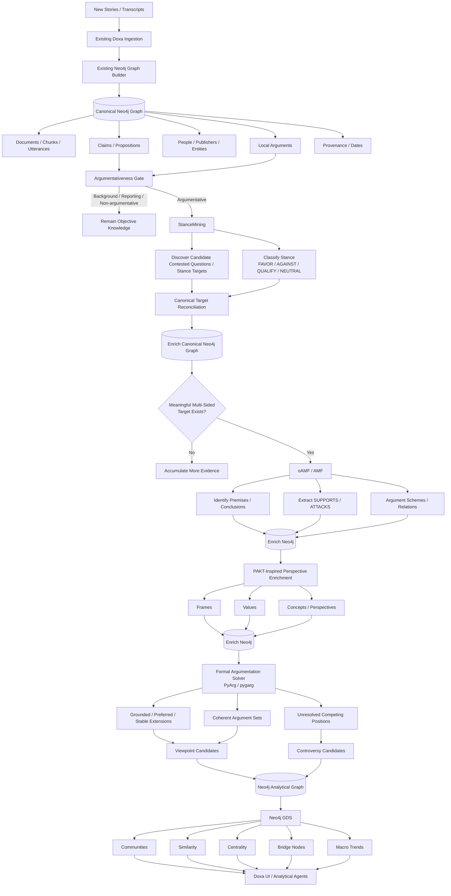
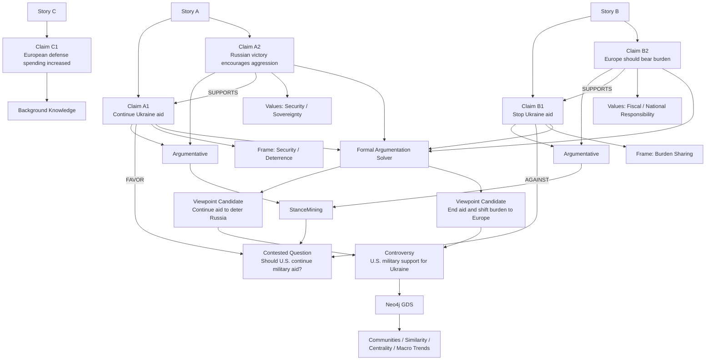

# Doxa Revised Analytical Reasoning Architecture

## Objective

Doxa already has a strong objective knowledge graph built in Neo4j.

The existing ingestion and graph-building pipeline performs well at extracting and connecting:

- Documents / stories
- Segments / chunks / utterances
- Propositions / claims
- Local arguments
- People
- Organizations
- Publishers
- Entities
- Events
- Provenance
- Dates and source relationships

Do **not** replace this architecture.

The current weakness is L3+ meta-analysis: Doxa is too willing to interpret topical relatedness as actual disagreement.

The goal is to add a dedicated analytical reasoning stack on top of the existing graph while keeping Neo4j as the single canonical source of truth.

---

# Core Problem

The current controversy pipeline can effectively behave like:

```text
Related propositions
        ↓
pair classification
        ↓
agree / oppose edges
        ↓
Viewpoints
        ↓
Controversies
```

This creates a structural failure mode:

> Two statements can be about the same question without actually opposing one another.

Graph clustering then amplifies a few bad `oppose` relationships into apparently meaningful controversies.

The replacement architecture should instead require:

```text
argumentative material
        ↓
shared explicit contested question
        ↓
meaningful incompatible stances
        ↓
argument structure
        ↓
formal conflict/coherence
        ↓
Viewpoint / Controversy
```

The fundamental rule is:

**Topical relatedness generates candidates. It does not establish controversy.**

---

# Target Architecture



---

# Responsibility of Each Layer

## 1. Neo4j — Objective Discourse Substrate

Neo4j remains authoritative for:

```text
Who said what?
Where did it come from?
When was it said?
What entities were involved?
What claims and local arguments were present?
```

This includes all current provenance.

Do not recreate:

- Person
- Publisher
- Story
- Claim
- Entity
- Event

inside downstream analytical systems.

Every analytical inference must ultimately point back to these existing nodes.

---

# 2. Argumentativeness Gate

Before material can influence Viewpoints or Controversies, determine whether it is actually argumentative.

Background facts, reporting and incidental semantic similarity should remain available in the knowledge graph but should not automatically enter debate topology.

Potential existing evidence includes:

- local `Argument` nodes
- speech acts
- modality
- prescription
- judgment
- allegation
- prediction
- conclusion-like propositions

Examples:

```text
"European defense spending increased 8%."
```

Likely background/objective material.

```text
"The U.S. should stop funding Ukraine because Europe should defend itself."
```

Clearly argumentative.

This gate should substantially reduce false controversy membership before any expensive analysis occurs.

---

# 3. StanceMining — Contested Question and Stance Layer

StanceMining is the first major analytical enrichment.

Its responsibility is:

```text
What proposition/question is actually being debated?

Where does this claim stand relative to that proposition?
```

Example:

```text
Canonical StanceTarget:

"The U.S. should continue military aid to Ukraine."
```

Then:

```text
Claim A → FAVOR
Claim B → AGAINST
Claim C → NEUTRAL
Claim D → QUALIFY
```

The exact labels should follow what StanceMining reliably exposes; Doxa can normalize them into its own analytical taxonomy.

StanceMining should not independently build another knowledge graph.

Instead:

```text
Neo4j claims/chunks
        ↓
StanceMining
        ↓
analytical results
        ↓
map back onto original Neo4j node IDs
```

---

# 4. Canonical Target Reconciliation

This is a Doxa-owned layer and is critical.

Continuous batches may discover:

```text
"Continue aid to Ukraine"

"Maintain American weapons assistance to Kyiv"

"Should the United States keep supplying Ukraine?"

"Continued U.S. military support for Ukraine"
```

These may represent the same underlying proposition.

Before creating a new `StanceTarget`, compare it against existing targets.

Potential reconciliation signals:

- embedding similarity
- entities
- predicate/action
- subject/object structure
- polarity
- temporal qualifiers
- scope qualifiers
- LLM adjudication only when ambiguous

Do not merge targets merely because they share a topic.

For example:

```text
"Should the U.S. send aid to Ukraine?"
```

is not necessarily identical to:

```text
"Should NATO admit Ukraine?"
```

Target identity should be proposition-level, not topic-level.

---

# 5. Proposed Stance Graph

Adapt this to the existing schema rather than blindly recreating it.

```text
(:Claim)
    ├─[:HAS_STANCE {
    │      stance: "FAVOR",
    │      confidence: 0.94,
    │      processor: "stancemining",
    │      processor_version: "...",
    │      analysis_run_id: "..."
    │   }]
    │
    ▼
(:StanceTarget {
    proposition: "The U.S. should continue military aid to Ukraine"
})
```

Multiple claims can converge on the same target:

```text
Claim A ──FAVOR─────┐
Claim B ──FAVOR─────┤
                    ├──> StanceTarget
Claim C ──AGAINST───┤
Claim D ──QUALIFY───┘
```

This becomes the primary substrate from which real controversies can emerge.

---

# 6. oAMF / AMF — Argument Structure Layer

StanceMining identifies **where** someone stands.

Argument mining identifies **why**.

Use oAMF/AMF selectively on material attached to mature or meaningful stance targets.

AMF should receive original text/context, not merely StanceMining outputs.

Its responsibilities include:

- argument-unit segmentation
- premise identification
- conclusion identification
- support relations
- attack relations
- argument schemes where useful

Example:

```text
Claim A:
"The U.S. should continue military aid to Ukraine."

Claim A2:
"A Russian victory would encourage further aggression."

A2 ──SUPPORTS──> A
```

Opposing side:

```text
Claim B:
"The U.S. should stop sending weapons to Ukraine."

Claim B2:
"European governments should pay for Europe's defense."

B2 ──SUPPORTS──> B
```

Possible rebuttal:

```text
Claim C:
"European defense spending has already risen significantly."

C ──ATTACKS / UNDERCUTS──> B2
```

The exact attack taxonomy should be validated against AMF capabilities before hard-coding it.

---

# 7. PAKT-Inspired Perspective Enrichment

PAKT should be treated primarily as an architectural and schema precedent, not necessarily as a monolithic runtime stage.

PAKT demonstrates that mature argumentation knowledge graphs can enrich arguments with dimensions such as:

- Frames
- Values
- Concepts
- Perspectives
- Camps
- Background knowledge

Doxa should adopt these ideas gradually where useful.

Example:

Two people might both be `AGAINST` Ukraine aid.

But their reasoning can be different.

### Position A

```text
AGAINST Ukraine aid

Frame:
Fiscal responsibility

Value:
Domestic stewardship
```

### Position B

```text
AGAINST Ukraine aid

Frame:
Non-intervention

Value:
National sovereignty
```

Stance alone would put these together.

PAKT-inspired dimensions explain **why they are not necessarily the same viewpoint**.

Likewise, two opposing arguments may surprisingly appeal to the same value.

Example:

```text
FAVOR:
"We must defend sovereignty against Russian aggression."

AGAINST:
"European nations must take responsibility for defending their own sovereignty."
```

Both invoke sovereignty but apply it differently.

That is valuable Doxa analysis.

Do not block the initial implementation on full PAKT enrichment.

Treat Frames/Values as a later enrichment dimension after stance and argument structure are working.

---

# 8. Formal Argumentation Layer

After high-confidence `SUPPORTS` / `ATTACKS` relationships exist, export a local Arena / StanceTarget subgraph into a formal argumentation framework.

Use an existing open-source solver such as:

- PyArg
- pygarg

Do not implement Dung semantics from scratch.

Conceptually:

```text
Arguments = nodes

ATTACKS = directed attack relationships
```

The solver computes formal semantics such as:

- grounded extension
- preferred extensions
- stable extensions
- complete extensions

These identify sets of arguments that can coherently coexist or defend themselves against attacks.

Important:

Do not initially hard-code:

```text
Preferred Extension = Viewpoint
```

or:

```text
Multiple Preferred Extensions = Controversy
```

Treat solver output as a **strong analytical signal** used to assemble and validate product-level Viewpoints and Controversies.

Empirically test the mapping against real discourse.

---

# 9. Revised Viewpoint Definition

A Viewpoint should not simply be:

```text
connected AGREE propositions
```

A stronger Viewpoint candidate is something like:

```text
same canonical StanceTarget
+
compatible stance
+
coherent supporting argument set
+
possibly shared frame/value patterns
+
survives formal argumentation consistency checks
```

Therefore two people can both be `AGAINST` the same proposition but belong to distinct Viewpoints if their underlying argument structures differ materially.

Example:

```text
Viewpoint 1:
Stop Ukraine aid because Europe should assume responsibility.

Viewpoint 2:
Stop Ukraine aid because foreign intervention itself is harmful.
```

Same stance.

Different argument structures.

Potentially different viewpoints.

---

# 10. Revised Controversy Definition

A Controversy should be **question-driven and opposition-driven**, not similarity-driven.

Potential requirements:

```text
one canonical Contested Question / StanceTarget

+

meaningful evidence on multiple incompatible sides

+

argumentative material

+

sufficient provenance/source diversity

+

high enough analytical confidence
```

Formal AF disagreement can further strengthen the case.

Conceptually:

```text
(:Controversy)
    └─[:ABOUT]→(:StanceTarget)

(:Viewpoint)
    └─[:POSITION_ON]→(:StanceTarget)

(:Viewpoint)-[:OPPOSES]->(:Viewpoint)
```

The exact schema should conform to the existing Doxa model.

---

# 11. GDS — Macro Analytical Layer

GDS should not determine whether language is contradictory.

By the time GDS runs, semantic relationships should already have meaningful definitions.

GDS then asks:

```text
What patterns emerge across thousands of debates?
```

Potential uses:

### Community detection

Find groups of people or arguments that repeatedly align structurally.

### Node similarity

Find people with similar stance profiles across many issues.

### Betweenness

Find actors or arguments connecting otherwise separated communities.

### PageRank / centrality

Identify structurally important:

- people
- arguments
- stance targets
- frames
- values

### Community evolution

Track how discourse communities change over time.

---

# 12. GDS Must Use Purpose-Built Projections

Do not simply project the entire heterogeneous Neo4j graph.

Examples:

### Ideological / stance similarity

```text
Person → StanceTarget
```

weighted by stance.

### Argument communities

```text
Argument → SUPPORTS / ATTACKS → Argument
```

### Frame/value communities

```text
Person → Argument → Value
Person → Argument → Frame
```

### Issue similarity

```text
StanceTarget ← Person → StanceTarget
```

Different projections answer different questions.

---

# 13. End-to-End Worked Example

Assume three stories are ingested.

### Senator Adams

> “Continued military assistance to Ukraine is essential. If Russia succeeds, it will encourage further aggression in Europe.”

### Senator Baker

> “The United States should stop sending weapons to Ukraine. Europe needs to carry the burden instead.”

### Analyst Clark

> “European countries increased defense spending again this year.”

---

## Stage 1 — Neo4j

Neo4j creates objective nodes:

```text
Adams
Baker
Clark

Ukraine
Russia
Europe

Story A
Story B
Story C

Claim A1:
"Military assistance should continue."

Claim A2:
"Russian success would encourage aggression."

Claim B1:
"The U.S. should stop sending weapons."

Claim B2:
"Europe should carry the burden."

Claim C1:
"European defense spending increased."
```

All retain provenance.

---

## Stage 2 — Argumentativeness Gate

```text
A1 → argumentative
A2 → argumentative/supporting claim

B1 → argumentative
B2 → argumentative/supporting claim

C1 → primarily factual/background
```

Clark remains in the knowledge graph but is not automatically treated as part of a debate.

---

## Stage 3 — StanceMining

Discover canonical target:

```text
Should the U.S. continue military aid to Ukraine?
```

Results:

```text
A1 → FAVOR

B1 → AGAINST

C1 → NEUTRAL / NO STANCE
```

Now there is real evidence of opposition.

---

## Stage 4 — AMF

AMF analyzes original relevant text.

```text
A2 ──SUPPORTS──> A1

B2 ──SUPPORTS──> B1
```

Now Doxa understands why each person takes their position.

---

## Stage 5 — PAKT-Inspired Enrichment

Possible classifications:

```text
A1/A2:

Frame:
Deterrence / security

Values:
Security
Sovereignty
Alliance responsibility
```

```text
B1/B2:

Frame:
Burden sharing / domestic responsibility

Values:
Fiscal responsibility
National responsibility
```

These dimensions help distinguish genuinely different reasoning patterns.

---

## Stage 6 — Formal AF Solver

Input:

```text
A1
A2
B1
B2

SUPPORTS relationships

plus validated ATTACK relationships
```

The solver identifies coherent defensible argument sets.

Potential result:

```text
Argument Set A:
A1 + A2

Argument Set B:
B1 + B2
```

These become strong Viewpoint candidates.

---

## Stage 7 — Controversy

Because:

```text
same canonical question

+

meaningful FAVOR evidence

+

meaningful AGAINST evidence

+

coherent competing argument structures
```

Doxa creates:

```text
Controversy:
U.S. military support for Ukraine
```

Clark's fact remains available as evidence/context but was never falsely turned into an opposing viewpoint.

---

# Worked Example Diagram



---

# Processing Cadence

The architecture should continue to grow organically through scheduled processing.

Conceptually:

```text
Continuous / frequent:
Story ingestion → Neo4j

Frequent batch:
Argumentativeness + StanceMining

After each stance batch:
Target reconciliation

Selective / threshold-triggered:
AMF argument mining

Selective:
Frame/value enrichment

After mature argument structures:
Formal AF solving

Daily / weekly / threshold-based:
GDS recomputation
```

Do not run every expensive analytical layer against every chunk automatically.

Use earlier layers as filters for later ones.

---

# Provenance Requirements

Every analytical inference needs metadata.

At minimum:

```text
processor
processor_version
model
model_version
confidence
analysis_run_id
created_at
source_claim_id
source_chunk_id
source_document_id
input_hash
```

Objective facts and analytical inference must remain distinguishable.

---

# Idempotence

All scheduled enrichment jobs must be safely rerunnable.

Use:

```text
input hash
processor version
model version
analysis version
```

to determine whether work needs to run again.

Model upgrades should support intentional reprocessing.

---

# Existing Controversies

Do not immediately delete the current controversy layer.

Instead:

1. Keep existing controversies available.
2. Run the new pipeline against representative historical material.
3. Compare:
   - existing controversy membership
   - StanceMining results
   - argument structures
   - AF output
4. Quantify false positives and false negatives.
5. Replace or migrate only after the new architecture materially outperforms the current logic.

---

# Recommended Implementation Sequence

## Phase 1 — Current-State Inspection

Inspect:

- existing Neo4j schema
- current L0–L4 definitions
- Proposition nodes
- Argument nodes
- Topic/Arena logic
- Viewpoint logic
- Controversy logic
- `RELATES_TO`
- agree/oppose classification
- Decision provenance

Map exactly where the new layers integrate.

Do not redesign lower layers.

---

## Phase 2 — Argumentativeness Gate

Create the smallest possible filter that prevents obvious non-argumentative propositions from entering controversy assembly.

Prefer reusing existing:

- Argument nodes
- `HAS_ROLE`
- speech acts
- existing metadata

before adding another model.

Measure the immediate reduction in false controversy members.

---

## Phase 3 — StanceMining Proof of Concept

Run StanceMining on a controlled sample of existing material.

Validate:

- target quality
- stance quality
- false controversy reduction
- neutral/orthogonal handling
- duplicate target behavior

Do not initially write results permanently.

---

## Phase 4 — Canonical StanceTarget Schema + Reconciliation

Implement:

```text
Neo4j read
→ StanceMining
→ reconciliation
→ Neo4j write
```

Add only the minimal analytical schema required.

---

## Phase 5 — CQ-First Controversy Logic

Modify controversy generation so that:

```text
same Arena
```

is insufficient.

Require:

```text
same canonical target
+
incompatible meaningful stances
```

Demote proposition pair `oppose` relationships to evidence/candidate generation rather than controversy authority.

---

## Phase 6 — oAMF / AMF Proof of Concept

Choose mature StanceTargets.

Run argument mining against the original relevant text.

Measure:

- premise/conclusion quality
- support relation quality
- attack relation quality

Write these back only after acceptable quality is demonstrated.

---

## Phase 7 — PAKT-Inspired Enrichment

Study PAKT's graph model and implementation closely.

Prototype:

- `Frame`
- `Value`
- possibly `Perspective`

on a limited number of debates.

Do not add every PAKT concept automatically.

Adopt only dimensions that materially improve Doxa's analytical output.

---

## Phase 8 — Formal AF Solver

Integrate PyArg or pygarg.

Build an adapter:

```text
Neo4j Arena / StanceTarget subgraph
        ↓
formal AF representation
        ↓
solver
        ↓
extensions / consistency results
        ↓
Decision-backed Neo4j analytical results
```

Initially use AF results to **score/validate** Viewpoint and Controversy candidates rather than making solver output the sole authority.

---

## Phase 9 — GDS

Once sufficient high-quality analytical edges exist, implement purpose-built graph projections and run:

- Leiden / Louvain
- Node Similarity
- PageRank
- Betweenness

Use these for macro-level discovery.

---

# Technology Roles

| Technology | Role |
|---|---|
| Neo4j Graph Builder | Objective discourse graph |
| Existing Doxa graph-worker | Claims, propositions, entities, local arguments, provenance |
| StanceMining | Corpus-level contested-question / stance discovery |
| Doxa reconciliation logic | Canonical target identity across batches |
| oAMF / AMF | Argument units and support/attack relationships |
| PAKT | Architectural precedent for frames, values and perspectivized argument graphs |
| PyArg / pygarg | Formal argumentation reasoning |
| Neo4j GDS | Macro graph analytics |
| Doxa | Orchestration, persistence, provenance, product semantics and UI |

---

# Final Conceptual Stack

```text
RAW MEDIA
   ↓
OBJECTIVE KNOWLEDGE
Neo4j
   ↓
ARGUMENTATIVE MATERIAL
Gate
   ↓
CONTESTED QUESTION + STANCE
StanceMining
   ↓
ARGUMENT STRUCTURE
oAMF / AMF
   ↓
PERSPECTIVE
PAKT-inspired Frames / Values
   ↓
FORMAL DIALECTICAL STRUCTURE
PyArg / pygarg
   ↓
VIEWPOINTS + CONTROVERSIES
Doxa
   ↓
MACRO STRUCTURE
Neo4j GDS
   ↓
ANALYSIS / EXPLORATION / DEBATE
Doxa UI + agents
```

The critical architectural invariant is:

> Every higher-order conclusion must remain traceable through the analytical graph back to claims, source text, speaker, publisher and timestamp.

Doxa should progressively transform raw discourse into structured interpretation without ever losing the evidence beneath that interpretation.

---

# Immediate Cursor Task

Do **not** implement the full architecture immediately.

First inspect the repository and produce a concrete integration RFC describing how this revised architecture maps onto the current implementation.

The RFC should identify:

1. Existing node/relationship types that already satisfy these requirements.
2. Which existing current L3 handlers should remain.
3. Which current handlers should be demoted to candidate generation.
4. Which current handlers should eventually be replaced.
5. How to introduce an argumentativeness gate with minimal changes.
6. The best existing Neo4j text/context representation to feed StanceMining.
7. The minimum schema required for canonical `StanceTarget` enrichment.
8. How target reconciliation will work across scheduled batches.
9. Where oAMF/AMF can attach to existing Argument/Proposition nodes without duplicating them.
10. How PAKT's Frames/Values model could map onto the existing schema.
11. How a PyArg/pygarg adapter would consume a local argument subgraph and return Decision-backed results.
12. Which GDS graph projections will eventually be useful.
13. A phased migration strategy that keeps the live current pipeline operational throughout development.

The first implementation milestone after the RFC should be:

**Argumentativeness Gate + StanceMining proof of concept against existing controversies.**

The key success metric is:

> Does CQ-first stance analysis materially reduce false controversies caused by semantically related but non-opposing statements?

Only after that is demonstrated should implementation proceed deeper into AMF, PAKT-style enrichment, AF solving and GDS.