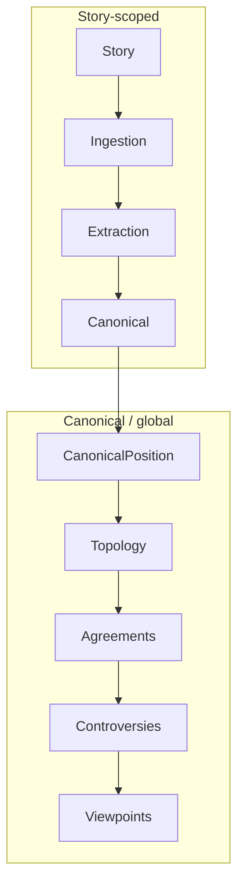

# Admin pipeline operations roadmap

Persistent plan for expanding the admin center into a Salesforce-style pipeline operations surface: search records, inspect pipeline stage, trace lineage, and rerun/revert steps.

**Phase 0 (done):** Generated pipeline catalog, stage-grouped story checklist (ingestion → extraction → canonical), ingestion run-step support.

**Phase 1 (done):** Story hub + `/ingestion`, `/extraction`, `/canonical` stage pages; shared pipeline components; `reset_story_canonical_links` RPC; unified search on Admin Center hub.

UI summary: [/admin/pipeline-roadmap](/admin/pipeline-roadmap). Docs: [admin-story-extraction-review.md](./admin-story-extraction-review.md), [pipeline-catalog.md](../doxa-agents/docs/generated/pipeline-catalog.md).

---

## Vision

Operators should be able to:

1. **Search** for a story, claim, canonical position, agreement cluster, or controversy
2. Open a **record hub** with summary metadata and a macro pipeline journey
3. Drill into **stage pages** with substeps, outputs, and run/revert actions
4. **Trace** downstream/upstream relationships (story → canonical → topology)
5. **Rerun** individual agents as prompts change, with clear impact warnings on shared canonical data

## Two pipeline scopes

Not everything is `story_id`-scoped. Design around two scopes:

| Scope | Record hub | Pipeline stages |
|-------|------------|-----------------|
| **Story** | `/admin/stories/[id]` | Ingestion → extraction → canonicalization |
| **Canonical / global** | `/admin/records/positions/[id]`, `/admin/records/claims/[id]` | Subtopics → pair candidates → relationships → agreement clusters → controversies → viewpoints |

Story evidence stays at story level. Topology operates on canonical positions only.

---

## Information architecture (target)

| Route | Purpose |
|-------|---------|
| `/admin` | Admin Center hub — search, status, navigation to all modules |
| `/admin/stories/[id]` | Story hub (article review + macro stepper) |
| `/admin/stories/[id]/ingestion` | Ingestion substeps in depth |
| `/admin/stories/[id]/extraction` | Extraction + merge QA substeps |
| `/admin/stories/[id]/canonical` | Canonical linkers + stance backfill |
| `/admin/records/claims/[id]` | Canonical claim hub |
| `/admin/records/positions/[id]` | Canonical position hub + topology stage |
| `/admin/agreements/[id]` | Agreement cluster hub |
| `/admin/controversies/[id]` | Controversy hub + lineage (extends existing page) |

---

## Phase 1 — Story pipeline complete (done)

**Goal:** Split the monolithic story page into a hub + stage subpages; add canonical-only revert and unified search.

### Deliverables

1. **Story hub redesign**
   - Macro horizontal stepper: Ingestion → Extraction → Canonical → (link to positions contributed)
   - Default landing remains two-pane article + extraction review
   - Stage pages host the detailed checklist (move from hub sidebar)

2. **Stage sub-routes**
   - `/admin/stories/[id]/ingestion`
   - `/admin/stories/[id]/extraction`
   - `/admin/stories/[id]/canonical`

3. **`reset_story_canonical_links` RPC**
   - Unlink canonical IDs for one story without wiping extraction
   - Orphan-only cleanup for claims/events/positions (mirror `reset_story_extraction` semantics)
   - Admin API: `POST /api/admin/stories/[id]/clear-canonical`

4. **Unified admin search**
   - `GET /api/admin/search?q=` — stories (title/URL/UUID), claims (text), positions (label)
   - Result cards with record type + current stage badge

5. **Extract shared components** to `components/admin/pipeline/`
   - `PipelineStepper`, `PipelineChecklist`, `RunStepButton`, polling hook

### Prerequisites

Phase 0 catalog and `lib/admin/pipeline-status/*` modules.

---

## Phase 2 — Canonical record hubs

**Goal:** Salesforce-style hubs for canonical entities with read-first topology inspection.

### Deliverables

1. **Claim hub** — `/admin/records/claims/[id]`
   - Canonical text, embedding metadata, linked stories
   - Canonical stage checklist (link step already done; show status)

2. **Position hub** — `/admin/records/positions/[id]`
   - Upgrade trace from existing `/admin/positions` detail
   - Topology stage page: subtopics, `position_pair_candidates`, `position_relationships`, agreement memberships

3. **Generic run-step API**
   - `POST /api/admin/pipeline/run-step` with `{ step, scope: { story_id?, canonical_position_id?, ... } }`
   - Deprecate story-only route or proxy to generic

4. **Trace APIs**
   - `GET /api/admin/trace/story/[id]`
   - `GET /api/admin/trace/position/[id]` — reuse Atlas scope patterns

### Notes

Most topology steps are batch/cron. UI must distinguish:

- **Run for this record** (when isolation param exists, e.g. `canonical_position_id`)
- **Queue / mark stale** (enqueue for next cron)
- **Run full batch** (dangerous; admin-only with confirmation)

---

## Phase 3 — Cluster and controversy ops

**Goal:** Operate on agreement clusters and controversies with lineage visibility and scoped revert.

### Deliverables

1. **Agreement hub** — `/admin/agreements/[id]`
   - Members, claims, cluster relationships, summaries

2. **Controversy hub upgrade** — extend `/admin/controversies`
   - `controversy_cluster_lineage` visualization (table or simple graph)
   - Link to agreement clusters and viewpoints

3. **Topology run-step** for cluster-scoped steps
   - `generate_agreement_cluster_candidates` with `agreement_cluster_id`

4. **Revert RPCs** (careful design)
   - `reset_topology_for_position(canonical_position_id)` — pairs, relationships, cluster membership
   - Document shared-entity impact before delete
   - Source table order in new `doxa-agents/ops/reset-scope.yaml` (mirror purge-engine pattern)

---

## Phase 4 — Operator polish

**Goal:** Audit trail, batch maintenance, and fleet health.

### Deliverables

1. **`pipeline_runs` history panel** per record — last N runs affecting this story/position
2. **Batch actions** — e.g. re-run canonical for stories with QA passed in last 24h
3. **Stage-level health** — extend `/admin/health` with extraction/canonical/topology queue depths
4. **Prompt version tagging** on reruns — know which outputs are stale after prompt changes
5. **`admin_pipeline_actions` audit table** (optional) — admin user + scope + step + timestamp

---

## Shared technical foundations (across phases)

| Component | Location | Status |
|-----------|----------|--------|
| Pipeline catalog overlay | `doxa-agents/ops/pipeline-admin-catalog.yaml` | Phase 0 |
| Generated catalog | `lib/admin/generated/pipeline-catalog.ts` | Phase 0 |
| Status derivation | `lib/admin/pipeline-status/*` | Phase 0 |
| Isolation params reference | `doxa-agents/docs/pipeline-test-params.md` | Exists |
| Story extraction reset | `reset_story_extraction` RPC | Exists |
| Engine purge | `purge_engine_data()` | Exists |

### Extend catalog for topology (Phase 2+)

Add stages to `pipeline-admin-catalog.yaml`:

- `topology-position` — assign-ranked-subtopics through classify-position-relationships
- `topology-cluster` — build-agreement-clusters through build-controversy-clusters
- `narratives` — generate-agreement-summaries, generate-viewpoints

Add matching `lib/admin/pipeline-status/topology-*.ts` modules.

---

## Risks and explicit non-goals

- **Do not build a custom workflow engine** — keep DB-derived status + edge invokes
- **Do not put 40 steps on one page** — stage pages are mandatory at scale
- **Do not hand-maintain step lists** — always generate from manifest + overlay
- **Topology revert before read-only topology admin** — inspect first, mutate second
- **Never silently delete shared canonical rows** — always show cross-story impact

---

## Related docs

- [Admin story extraction review](./admin-story-extraction-review.md) — current story QA UI
- [Pipeline catalog (generated)](../doxa-agents/docs/generated/pipeline-catalog.md) — stage/step table
- [Pipeline test params](../doxa-agents/docs/pipeline-test-params.md) — per-step isolation
- [Topology pipeline](../doxa-agents/docs/topology-pipeline.md) — debate intelligence layers
- [AGENTS.md](../doxa-agents/AGENTS.md) — pipeline agent catalog
