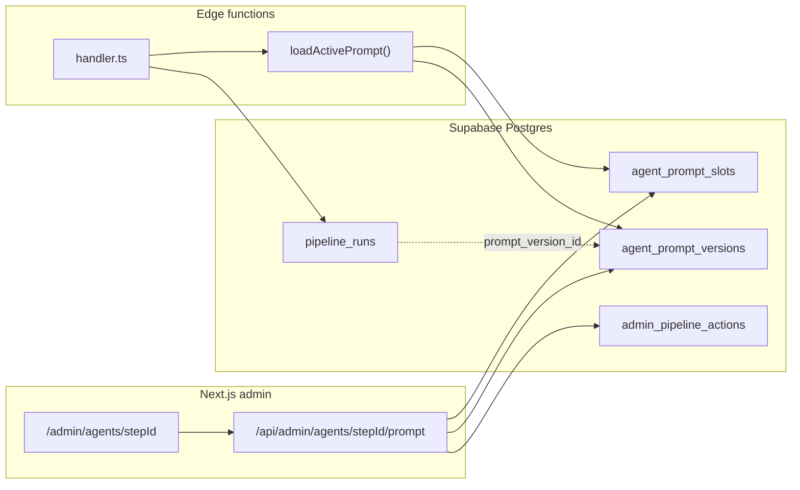

# Agent prompt store — specification

Design for storing, versioning, and editing LLM system prompts per pipeline agent, with admin UI on `/admin/agents/[stepId]`.

**Context:** Today only `extract-story-claims` has an in-use LLM prompt. Downstream agents are being rebuilt with a **1:1 step → prompt** convention. Agents without an LLM (deterministic, embeddings-only, orchestration) declare `prompt_kind: none` and the admin page states that plainly.

Related: [admin-pipeline-ops-roadmap.md](./admin-pipeline-ops-roadmap.md) (Phase 4 prompt version tagging), [pipeline-catalog.md](../doxa-agents/docs/generated/pipeline-catalog.md).

---

## Goals

| Goal | Detail |
|------|--------|
| **View** | Every agent page shows the active system prompt, or “No LLM prompt” |
| **Edit** | Admins create a new prompt version and activate it without redeploying edge functions |
| **Version history** | Immutable versions, diff-friendly, rollback to any prior version |
| **Provenance** | `pipeline_runs` records which prompt version produced each run |
| **Audit** | Who changed what, when, with optional change notes |

## Non-goals (v1)

- Editing **user payload builders** in admin (remain handler code; UI documents the shape read-only)
- Prompt A/B testing or per-story prompt overrides
- Git write-back from admin (DB is runtime source of truth after cutover)
- Versioning **model** selection in the prompt store (stays on edge secrets / `pipeline_runs.model_name`)

---

## Architecture



**Source of truth:** Postgres active version per `step_id`. Handlers fetch at invoke time (with in-memory cache per isolate). Code-embedded `const SYSTEM_PROMPT` strings become **seed-only** during migration, then removed.

---

## Catalog overlay: `prompt_kind`

Extend `doxa-agents/ops/pipeline-admin-catalog.yaml` (merged at `npm run agents:pipeline-catalog`):

```yaml
steps:
  - id: extract-story-claims
    label: Extract primary claims
    prompt_kind: llm          # expects agent_prompt_slots row
    user_payload_doc: |       # read-only admin hint (optional)
      JSON user message: story_id, title, source_name, published_at, chunk_text
      Built by buildExtractClaimsUserPayload() in openai-qa.ts

  - id: chunk-story-bodies
    label: Chunk story bodies
    prompt_kind: none         # admin page shows "No LLM prompt"

  - id: link-canonical-claims
    label: Link canonical claims
    prompt_kind: embeddings   # optional sub-kind; still "no editable prompt"
```

| `prompt_kind` | Admin prompt section | DB row required |
|---------------|----------------------|-----------------|
| `llm` | Editable system prompt + version history | Yes (`agent_prompt_slots`) |
| `none` | “This agent does not use an LLM system prompt.” | No |
| `embeddings` | “Embeddings only (no chat system prompt).” | No |

`prompt_kind` is **declarative** in the catalog overlay. The librarian validates: every `prompt_kind: llm` step in the overlay must have a corresponding manifest `step.id`. Topology/legacy steps not in the overlay default to `none` until added.

---

## Database schema

Migration: `supabase/migrations/NNN_agent_prompt_store.sql`

### `agent_prompt_slots`

One row per agent that uses an LLM system prompt (`prompt_kind: llm`).

```sql
CREATE TABLE public.agent_prompt_slots (
  step_id text PRIMARY KEY,                    -- catalog step id, e.g. extract-story-claims
  deploy_name text NOT NULL,                   -- denormalized from manifest for edge lookups
  label text NOT NULL,                         -- denormalized display label
  active_version_id uuid,                      -- FK → agent_prompt_versions
  created_at timestamptz NOT NULL DEFAULT now(),
  updated_at timestamptz NOT NULL DEFAULT now()
);
```

- `step_id` matches `manifest.yaml` step `id` and `PipelineStepId` in the generated catalog.
- `deploy_name` lets edge handlers resolve by deploy name if needed (`extract_story_claims`).
- `active_version_id` NULL until first version is published.

### `agent_prompt_versions`

Append-only version history.

```sql
CREATE TABLE public.agent_prompt_versions (
  version_id uuid PRIMARY KEY DEFAULT gen_random_uuid(),
  step_id text NOT NULL REFERENCES public.agent_prompt_slots(step_id) ON DELETE CASCADE,
  version_number integer NOT NULL,             -- monotonic per step_id, starts at 1
  system_prompt text NOT NULL,
  content_hash text NOT NULL,                  -- sha256(system_prompt) for dedup warnings
  change_note text,                            -- admin-supplied on save
  created_at timestamptz NOT NULL DEFAULT now(),
  created_by uuid REFERENCES auth.users(id) ON DELETE SET NULL,
  UNIQUE (step_id, version_number)
);

CREATE INDEX idx_agent_prompt_versions_step_created
  ON public.agent_prompt_versions (step_id, created_at DESC);
```

**Activation:** Updating `agent_prompt_slots.active_version_id` does not mutate prior versions. Rollback = point `active_version_id` at an older `version_id`.

### `admin_pipeline_actions`

Append-only admin audit (Phase 4 roadmap item; scoped here to prompt ops).

```sql
CREATE TABLE public.admin_pipeline_actions (
  action_id uuid PRIMARY KEY DEFAULT gen_random_uuid(),
  occurred_at timestamptz NOT NULL DEFAULT now(),
  actor_id uuid REFERENCES auth.users(id) ON DELETE SET NULL,
  action_type text NOT NULL CHECK (
    action_type IN (
      'prompt_version_created',
      'prompt_version_activated',
      'prompt_version_rollback'
    )
  ),
  step_id text,
  prompt_version_id uuid REFERENCES public.agent_prompt_versions(version_id) ON DELETE SET NULL,
  detail jsonb NOT NULL DEFAULT '{}'::jsonb
);
```

`detail` examples:

```json
{ "from_version_id": "…", "to_version_id": "…", "change_note": "Tighten temporal scope rule" }
```

### `pipeline_runs` extension

```sql
ALTER TABLE public.pipeline_runs
  ADD COLUMN prompt_version_id uuid
    REFERENCES public.agent_prompt_versions(version_id) ON DELETE SET NULL;
```

Handlers that use the prompt store set this on run insert. Enables “outputs stale after prompt change” UX later.

### RLS

| Table | Edge (service role) | Admin UI |
|-------|-------------------|----------|
| `agent_prompt_slots` | `SELECT` active row | Full via Next.js service client |
| `agent_prompt_versions` | `SELECT` (active + by id) | Full via Next.js service client |
| `admin_pipeline_actions` | — | `INSERT` + `SELECT` via admin API |

Edge functions use `SUPABASE_SERVICE_ROLE_KEY` (already present). No anon/authenticated direct access.

### Bootstrap seed

One-time in migration or `supabase/seed_agent_prompts.sql`:

1. Insert slot for `extract-story-claims` / `extract_story_claims`.
2. Insert version 1 with text from current `EXTRACT_CLAIMS_SYSTEM_PROMPT` in `doxa-agents/lib/extraction-qa/openai-qa.ts`.
3. Set `active_version_id`.

Other `prompt_kind: llm` steps get slots when those agents are rebuilt; no preemptive seed for inactive legacy prompts.

---

## Runtime contract (edge handlers)

### Shared loader — `doxa-agents/lib/agent-prompts.ts`

```typescript
export type ActiveAgentPrompt = {
  versionId: string;
  versionNumber: number;
  stepId: string;
  systemPrompt: string;
};

export async function loadActivePrompt(
  supabase: SupabaseClient,
  stepId: string
): Promise<ActiveAgentPrompt | null>;

export async function loadActivePromptByDeploy(
  supabase: SupabaseClient,
  deployName: string
): Promise<ActiveAgentPrompt | null>;
```

**Behavior:**

1. Query `agent_prompt_slots` joined to `agent_prompt_versions` on `active_version_id`.
2. If no row or `active_version_id` is null → throw a clear error (`Prompt not configured for step …`). Do **not** silently fall back to code constants after cutover.
3. Cache result in module-level `Map<stepId, { prompt, fetchedAt }>` with TTL **60s** (prompt edits propagate within a minute without redeploy).

### Handler integration pattern

```typescript
// extract-story-claims/handler.ts (after cutover)
const prompt = await loadActivePrompt(supabase, "extract-story-claims");
if (!prompt) return json({ error: "Prompt not configured" }, 500);

const parsed = await callOpenAIJson(
  apiKey,
  model,
  prompt.systemPrompt,
  userPayload,
  // ...
);

// pipeline_runs insert
await supabase.from("pipeline_runs").insert({
  pipeline_name: "extract_story_claims",
  status: "running",
  model_name: MODEL,
  prompt_version_id: prompt.versionId,
  // ...
});
```

**User payload:** Unchanged. `buildExtractClaimsUserPayload()` stays in code. Admin UI shows `user_payload_doc` from catalog overlay as read-only documentation.

### Agents without prompts

Handlers with `prompt_kind: none` or `embeddings` do not call `loadActivePrompt`. No slot row required.

---

## Admin API

All routes require `requireAdmin()`. Use `createAdminClient()` (service role).

### `GET /api/admin/agents/[stepId]/prompt`

Response:

```typescript
type AgentPromptResponse = {
  promptKind: 'llm' | 'none' | 'embeddings'
  slot: {
    stepId: string
    deployName: string
    label: string
    activeVersion: {
      versionId: string
      versionNumber: number
      systemPrompt: string
      changeNote: string | null
      createdAt: string
      createdBy: string | null
    } | null
  } | null
  userPayloadDoc: string | null   // from catalog overlay
  recentVersions: Array<{
    versionId: string
    versionNumber: number
    createdAt: string
    changeNote: string | null
    isActive: boolean
  }>
}
```

- `prompt_kind: none` → `slot: null`, message in `promptKind`.
- `prompt_kind: llm` but no slot yet → `slot` with `activeVersion: null` (setup required).

### `POST /api/admin/agents/[stepId]/prompt`

Create version and optionally activate (default: activate).

```typescript
// Body
{ systemPrompt: string; changeNote?: string; activate?: boolean }

// Response
{ versionId, versionNumber, activated: boolean }
```

**Validation:**

- `systemPrompt` non-empty, max length 64 KB
- Trim whitespace; compute `content_hash`
- If hash matches active version → 409 with message “No changes from active version”
- `version_number` = `max(existing) + 1` in transaction
- On activate: update `agent_prompt_slots.active_version_id`, insert `admin_pipeline_actions`

### `POST /api/admin/agents/[stepId]/prompt/activate`

Rollback / switch without new content.

```typescript
// Body
{ versionId: string }
```

Validates `versionId` belongs to `stepId`. Updates slot; logs `prompt_version_rollback` or `prompt_version_activated`.

### `GET /api/admin/agents/[stepId]/prompt/audit`

Returns `admin_pipeline_actions` filtered by `step_id`, newest first.

Extend existing `GET /api/admin/agents/[stepId]` to include `promptKind` and `userPayloadDoc` from generated catalog (avoid extra round-trip on page load).

---

## Admin UI (`/admin/agents/[stepId]`)

Replace the v1 placeholder section.

### `prompt_kind: none` | `embeddings`

```text
No LLM system prompt
This agent does not use a chat completion system prompt.
```

For `embeddings`, append: “Uses embedding API only.”

### `prompt_kind: llm`

| Element | Behavior |
|---------|----------|
| **Active prompt** | Monospace `Textarea` (read mode default) showing full `system_prompt` |
| **Edit** | Toggle edit mode → Save creates new version (modal: change note) |
| **Version selector** | Dropdown or sidebar list; selecting loads that version read-only |
| **Activate** | On non-active version: “Set as active” → confirm → `POST …/activate` |
| **User payload** | Collapsible read-only block from `user_payload_doc` |
| **Source** | Footer link: `doxa-agents/departments/…/handler.ts` (from manifest `source`) |

**Audit trail section:** Wire to `GET …/prompt/audit` instead of placeholder text.

**Empty slot:** “Prompt not configured. Paste initial system prompt to create version 1.”

### UX constraints

- Warn on Save: “New version takes effect on the next agent run (within ~60s). Existing extractions are not retroactively updated.”
- No delete version (immutable history); only activation changes runtime behavior.

---

## Librarian / codegen

### `doxa-agents/ops/pipeline-admin-catalog.yaml`

Add `prompt_kind` and optional `user_payload_doc` per step (see above).

### `scripts/generate-pipeline-catalog.ts`

Emit into `lib/admin/generated/pipeline-catalog.ts`:

```typescript
export type PromptKind = 'llm' | 'none' | 'embeddings'

export type PipelineCatalogStep = {
  // …existing fields
  promptKind: PromptKind
  userPayloadDoc: string | null
}
```

Default `promptKind: 'none'` when omitted.

### `npm run agents:validate`

New checks:

- `prompt_kind: llm` → manifest step exists
- Warn (not fail) if `prompt_kind: llm` and no seed slot in `ops/agent-prompt-seeds.yaml` (optional bootstrap manifest for local dev)

### Optional `doxa-agents/ops/agent-prompt-seeds.yaml`

Dev/bootstrap only — **not** runtime source of truth:

```yaml
seeds:
  extract-story-claims:
    system_prompt_file: doxa-agents/lib/extraction-qa/openai-qa.ts
    export_name: EXTRACT_CLAIMS_SYSTEM_PROMPT
```

Script `npm run agents:seed-prompts` upserts slots if missing (local Supabase). Production uses SQL migration seed.

---

## Migration from code-embedded prompts

### Phase 1 — Store + read path (no admin edit yet)

1. Ship schema + seed `extract-story-claims` v1 from current constant.
2. Add `loadActivePrompt` with 60s cache.
3. Update `extract-story-claims` handler to load from DB; set `pipeline_runs.prompt_version_id`.
4. Admin UI: read-only active prompt from API.
5. Keep `EXTRACT_CLAIMS_SYSTEM_PROMPT` export marked `@deprecated seed-only` for one release.

### Phase 2 — Admin edit + audit

1. POST/activate API routes.
2. Editable UI + audit section.
3. Remove deprecated constant; seed script reads from seeds yaml for fresh installs only.

### Phase 3 — Downstream agents

As each rebuilt agent goes live:

1. Add `prompt_kind: llm` to catalog overlay.
2. Add slot + v1 seed (migration or admin UI).
3. Handler uses `loadActivePrompt`.
4. Remove inline `const system = …` from handler.

### Cutover rule

After Phase 1 for a step, **no silent fallback** to code constants. Missing active prompt = handler error. Forces explicit configuration.

---

## Staleness and reruns (future hook)

Not built in v1, but schema supports:

- Compare `story_chunks.extraction` run’s `prompt_version_id` to current active version.
- Story pipeline UI badge: “Extracted with prompt v3; active is v5.”
- Tie into existing run-step / revert flows from [admin-pipeline-ops-roadmap.md](./admin-pipeline-ops-roadmap.md).

---

## Security

- Prompt text may encode extraction policy; treat as admin-only (same as handler source).
- Service role on edge: read-only on prompt tables (no policy allowing edge to write versions).
- Rate-limit prompt POST API if needed (low volume admin ops).
- `content_hash` prevents accidental duplicate version spam.

---

## Testing

| Layer | What to test |
|-------|----------------|
| SQL | Slot/version FK, unique version_number, RLS smoke |
| `loadActivePrompt` | Cache TTL, missing slot error, join correctness |
| API | Auth gates, create/activate transactions, 409 on duplicate hash |
| UI | none vs llm rendering, edit → save → reload |
| E2E | Edit prompt → run `extract_story_claims` on test story → verify `pipeline_runs.prompt_version_id` |

---

## Implementation checklist

| # | Task | Owner |
|---|------|-------|
| 1 | Migration: tables + `pipeline_runs.prompt_version_id` + seed v1 | DB |
| 2 | `prompt_kind` in catalog overlay + codegen | Librarian |
| 3 | `doxa-agents/lib/agent-prompts.ts` loader + cache | Agents |
| 4 | `extract-story-claims` handler cutover | Agents |
| 5 | `GET/POST` admin prompt API | App |
| 6 | Agent page UI (view/edit/versions/audit) | App |
| 7 | `agents:validate` prompt_kind checks | Librarian |
| 8 | Docs: update PREVIEW_BRANCH prompt-tuning steps to admin UI | Docs |

**Deploy notes:** Schema migration on Supabase. Edge deploy `extract_story_claims` after handler change (`supabase functions deploy extract_story_claims --no-verify-jwt`). No redeploy needed for subsequent prompt edits.

---

## Open decisions

1. **Max versions retained** — Unlimited v1; add pruning policy later if needed.
2. **Draft vs published** — v1 skips drafts; every save is a published version (only activation gates runtime).
3. **Shared prompt blocks** — e.g. `METADATA_PROMPT_BLOCK` inlined in system text per agent (1:1 model). If a shared block changes, bump each dependent agent’s version manually. Future: `prompt_fragments` table — out of scope v1.
4. **Topology agents** — When added to admin catalog, use same `prompt_kind` convention; most batch classifiers get `llm` slots as they are rebuilt.

---

## Summary

The prompt store is a small, focused subsystem: **slots + immutable versions + active pointer**, loaded at edge runtime, edited through admin API, provenance on `pipeline_runs`. Non-LLM agents stay declarative via `prompt_kind: none`. The only in-use prompt today (`extract-story-claims`) is the first cutover candidate; downstream rebuilds register one slot per LLM agent as they ship.
