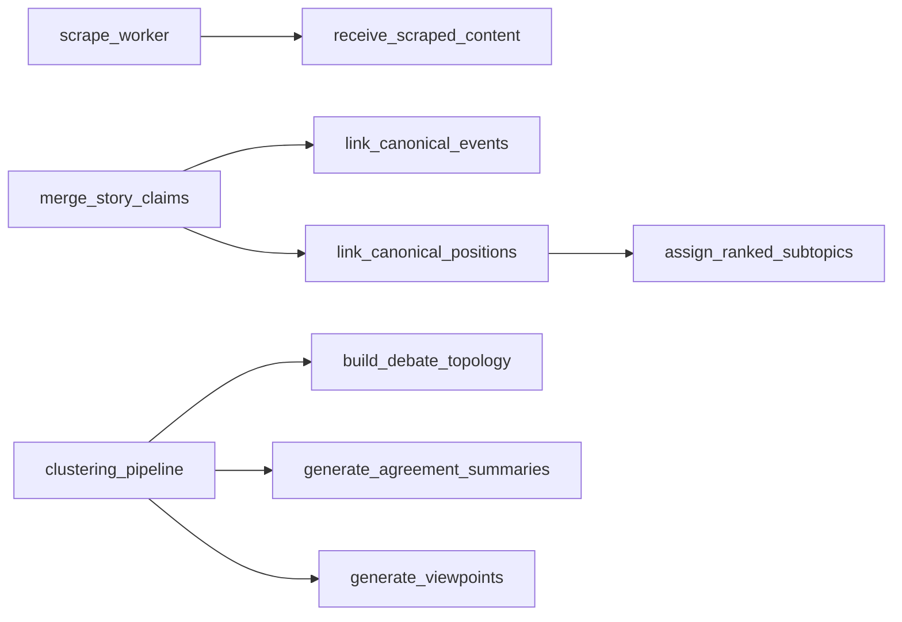

<!-- AUTO-GENERATED by npm run agents:docs — do not edit manually -->

# Pipeline graph

```mermaid
flowchart LR
  scrape_worker --> receive_scraped_content
  merge_story_claims --> link_canonical_events
  merge_story_claims --> link_canonical_positions
  link_canonical_positions --> assign_ranked_subtopics
  clustering_pipeline --> build_debate_topology
  clustering_pipeline --> generate_agreement_summaries
  clustering_pipeline --> generate_viewpoints
```

_Generated from manifest invokes._
